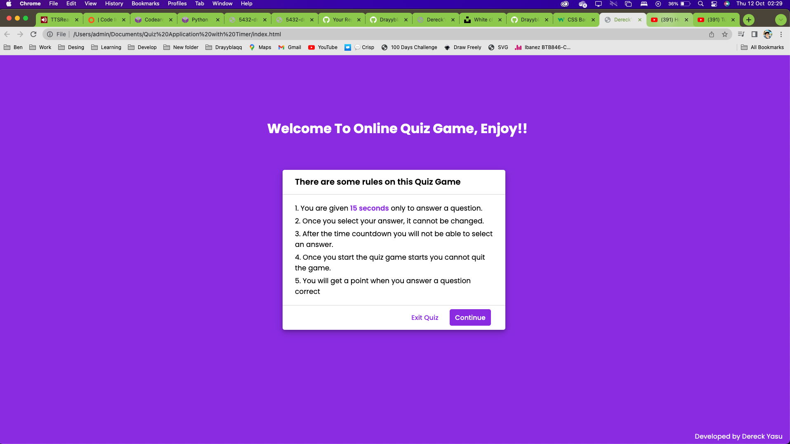
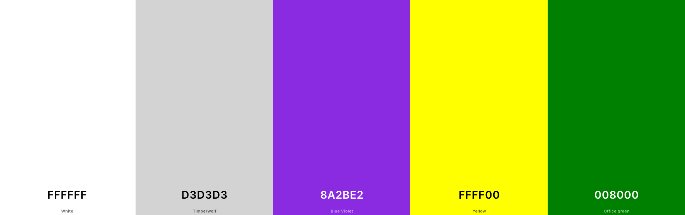
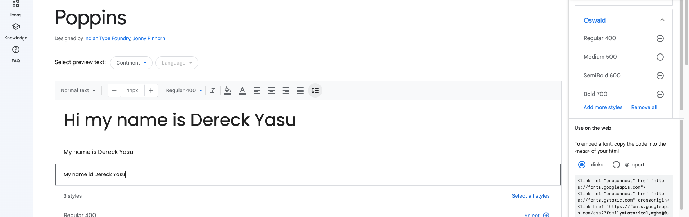

# QUIZ GAME BY DERECK YASU

Welcome to Online Quiz Game by Dereck - a portfolio quiz game. I have built this fully on code with html, css and javascript.

Online Quiz Game is built in html, css and javascript and it is not fully responsive on all devices as i did not have enough time to finish it because of the submition deadline how ever it is playable and looking forward to finish developing it soon. As a visitor you can play the quiz game, it has easy methemetical questions that only need one to know multiplication, division, addition and subtraction.

TO VIEW THE LATEST WEBSITE
[You can see the live website here.](https://drayyblacc.github.io/quiz-game/)

ALL GITHUB PAGES
[You can see the GitHub code pages here.](https://github.com/Drayyblacc/quiz-game)

---

## CONTENTS

- [LOVE RUNNING BY DERECK YASU](#online-quiz-by-dereck-yasu)
  - [CONTENTS](#contents)
  - [User Experience (UX)](#user-experience-ux)
    - [User Stories](#user-stories)
      - [Client Goals](#client-goals)
      - [First Time Visitor Goals](#first-time-visitor-goals)
      - [Returning Visitor Goals](#returning-visitor-goals)
      - [Frequent Visitor Goals](#frequent-visitor-goals)
  - [Design](#design)
    - [Colour Scheme](#colour-scheme)
    - [Typography](#typography)
    - [Imagery](#imagery)
  - [Features](#features)
    - [General features on each page](#general-features-on-each-page)
      - [Home Page](#home-page)
      - [Gallery](#gallery)
      - [Contact](#contact)
      - [Final Popup Info](#congratulations)
    - [Accessibility](#accessibility)
  - [Technologies Used](#technologies-used)
    - [Languages Used](#languages-used)
    - [Frameworks, Libraries \& Programs Used](#frameworks-libraries--programs-used)
    - [Deployment](#deployment)
    - [Local Development](#local-development)
      - [How to Fork](#how-to-fork)
      - [How to Clone](#how-to-clone)
  - [Testing](#testing)
  - [Credits](#credits)
    - [Code Used](#code-used)
    - [Content](#content)
    - [Media](#media)
    - [Acknowledgments](#acknowledgments)

---

## User Experience (UX)

### User Stories

Online Quize Game by Dereck is a web project made to to teach beginner mathemetics which can be played from the age of 2-3 years old.

#### Client Goals

- For kids to test their mathematical abilities.
- For every age group to play for fun.
- To allow visitors to view their scores after playing the game 

#### First Time Visitor Goals

- I want to test my skill in maths.
- I want to test my childs abilities.
- I want to find information easily without too many clicks.
- I want to see my final score.

#### Returning Visitor Goals

- I want to test myself again if i improved.
- I want to test my kid again if they still remember the answer.

#### Frequent Visitor Goals

- I want to play and master the questions in the game.
- I want to recommend my friend or anyone to play the maths quiz.

---

## Design

### Colour Scheme

The colour scheme for the website come from the developer to make sure everything is easily visible to the end user. The idea was to keep the quiz game looking colourful and beautiful.

### Typography

The fonts used on the website was chosen to make sure text is clear in all devices sizes

Google Fonts was used to import both fonts:

- Poppins is the font used on all of the text on the quiz game. This include both a bolder and a lighter font weight.

Font Awesome is also used for bullet points and the home index page and sign up page on the website.

### Imagery

The imagery on this website is all photography, with the odd Font Awesome icon appearing on the page. The favicon was from flaticon and some were from me, only the ones on README.

## Features

The Online Quiz Game has only one page but the page has feature of starting the game, rules and buttons to play also with a countdown timer to show the user how much seconds they have left with to answer the questions and it does not allow the user to choose an answer after the countdown timer expires, but it shows the user the answer in green color and not add a point to the score.

### General features on each page

- In the page thats where all features are and it also allows user to restart the game or quit the game.

#### Congratulations

A simple popup will show how much score the user got as a messege after finishing the game.

### Accessibility

I have tried my best to ensure the site has been made as accessible as possible by:

- Using simple HTML.
- Using alt attributes on images.
- Adding breathing text welcoming the user.
- Using colour contrasts between the text and background.
---

## Technologies Used

### Languages Used

HTML, CSS and Javascript was used to create this website.

### Frameworks, Libraries & Programs Used

- [Offline Visual Studio Code](https://app.codeanywhere.com/) -  platform cloud IDE to deploy workspace environment to Github.
- [Github](https://github.com/) - to edit the code and committing to repository and also was used to store and display all files and assets for the website.
- [Google Fonts](https://fonts.google.com/) - to import the fonts used on the website.
- [Font Awesome](https://fontawesome.com/icons) - to use icons on the website.
- [Google Dev Tools](https://developer.chrome.com/docs/) - to troubleshoot using inspect, test and solve issues with any styling.
- [W3C Markup Validator](https://validator.w3.org/) - to check the source code of my html files for any bugs.
- [W3C CSS Validator](https://jigsaw.w3.org/css-validator/) - to check the source code of my css file for any bugs.
- [Tiny PNG](https://jigsaw.w3.org/css-validator/) - to optimise images for the website.
- [Am I Responsive?](https://ui.dev/amiresponsive?) - to show the website on different responsive devices.

### Deployment

I used Github to deploy the live website. To deploy a website on Github, follow these steps:

1. Log in to Github - or set up a new account.
2. Find the repository for [Love Running by Dereck](https://github.com/Drayyblacc/quiz-game).
3. Click on 'Settings' along the top.
4. Click on 'Pages' in the left hand side navigation bar.
5. In the 'Source' section, make sure 'Deploy from a branch' is selected. Choose 'main' and 'Root' from the drop down menus and click Save.
6. Your live site is now deployed and can be viewed using the link provided.

### Local Development

Just download the zip to your local computer and you can edit it with the offline IDE.

#### How to Fork

To fork a repository on Github, follow below steps:

1. Log in to Github - or step up a new account.
2. Click on the repository for [Love Running](https://github.com/Drayyblacc/quiz-game).
3. Click the Fork button in the top right corner.

#### How to Clone

To clone a repository on Github, follow below steps:

1. Log in to Github - or step up a new account.
2. Find the repository for [Love Running](https://github.com/Drayyblacc/quiz-game).
3. Click on the code button, select whether you would like to clone with HTTPS, SSH or GitHub CLI and copy the link shown.
4. Open the terminal in your code editor and change the current working directory to the location you want to use for the cloned directory.
5. Type 'git clone' into the terminal and paste the link you copied in step 3. Press enter.

- - -

## Testing

I started this project in a wrong way as i was focusing mostly on function on the project i did not start the design with the mobile version so i have to add media queries for the devices and i will strong not suggest a developer to do that as that took most of my time trying to sort out and unfortunately did not finish the design properly.
  

[TESTING.md file](TESTING.md)

---

## Credits

### Code Used

- [W3Schools](https://www.w3schools.com/howto/howto_css_transition_hover.asp) - helped me style and create the form.
- [W3Docs](https://www.w3docs.com/tools/code-editor/3033) - helped me as i was getting stuck here and there on the project.
- [Medium](https://medium.com/) - helped me as i was getting stuck here and there on the project where i got stuck with media queries.
- [Geekforgeeks](https://www.geeksforgeeks.org/) - helped me understand my code where my javascript got stuck.
-[Freecodecamp](https://www.freecodecamp.org/) - helped me on javascript while creating my functions as i was making a lot of mistakes.
- [LoveRunning](https://drayyblacc.github.io/loverunning) - helped me in restructuring my readme file.
### Content

All content used on the site was written by Dereck Yasu the developer.

### Media

Most of the photos were provided on this Project are screenshot from my laptop as i was developing and taking screnshots and a favicon from flaticon.
### Acknowledgments

I would like to thank and appreciate the following people that hepled me throughout the project.

- Members of the Code Institute Slack. Some managed to respond to my questions and that helped me
- [Scott Clarke](mailto:Scott.clarke@codeinstitute.net) from Code Institute who signed me up to the course! 

For more information conatact me on my email [dereckben111@gmail.com](mailto:dereckben111@gmail.com)
